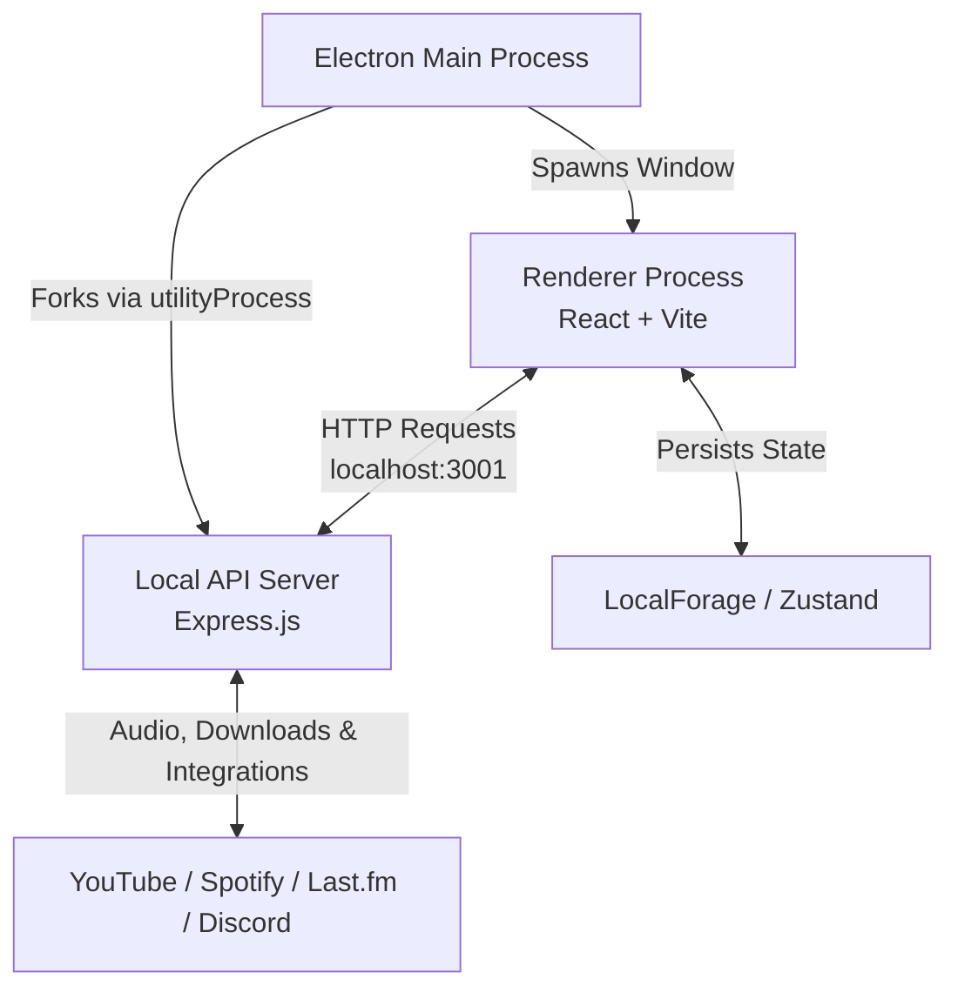

# Velune Desktop 🎵

Velune is a modern, cross-platform desktop music player built with Electron, React, TypeScript, and Vite. It offers a seamless listening experience with advanced library management, high-performance streaming, robust offline capabilities, and powerful integrations with platforms like Spotify, Last.fm, and Discord.

## ✨ Features

- **High-Performance Audio**: Seamless streaming powered by `youtubei.js` and custom audio engines.
- **Advanced Playback Modes**: Choose between the main player, a compact **Mini Player**, a full-screen **Full Player**, or a floating **Widget Player** that stays on top.
- **Smart Library & Offline Mode**: 
  - Save tracks, albums, and playlists.
  - Download music for offline listening. The Downloads tab automatically groups your saved tracks by their original album or playlist.
  - View your listening history as a chronological timeline or grouped by context (with smart badges showing exactly which playlist a song was played from).
- **Dynamic UI**: Real-time color extraction from album art dynamically themes the player. Enjoy fluid animations, custom title bars, and an integrated audio visualizer.
- **Integrations**: 
  - **Spotify Import**: Connect your Spotify account to import your playlists seamlessly.
  - **Last.fm Scrobbling**: Built-in integration to track and scrobble your listening stats.
  - **Discord Rich Presence**: Automatically show off what you're listening to on your Discord profile.
  - **Lyrics**: Built-in lyrics panel perfectly synchronized with your tracks.
- **Debounced Search**: Lightning-fast, optimized search experience that fetches results instantly without overloading the API.

## 📥 Installation (For General Users)

While Velune provides a standalone `.exe` / `.dmg` for the application interface, it relies on two external tools to fetch and process audio streams. **You must have both installed and available in your system PATH:**

1. **[FFmpeg](https://ffmpeg.org/download.html)**: Required for processing and extracting audio.
2. **[yt-dlp](https://github.com/yt-dlp/yt-dlp#installation)**: Required for resolving high-quality streaming URLs.

### Steps to Install:

1. Install FFmpeg and yt-dlp, ensuring both are added to your system's Environment Variables (`PATH`).
2. Download the latest `.exe` (Windows), `.dmg` (macOS), or `.AppImage` (Linux) from the [Releases](#) page.
3. Double-click the downloaded file to install.
4. Open Velune and start listening! (An internet connection is required to stream music and fetch metadata, but your downloaded songs can be played offline).

---

## 🛠️ Tech Stack

### Frontend (Renderer)
- **Framework**: React 18 & Vite
- **Language**: TypeScript
- **State Management**: Zustand (Modular stores: `playerStore`, `libraryStore`, `settingsStore`)
- **Routing**: React Router DOM
- **Animations & Styling**: Framer Motion + Vanilla CSS Modules

### Backend & Desktop Layer (Main Process)
- **Framework**: Electron
- **Local API**: Express.js server (Runs seamlessly within an Electron `utilityProcess` to handle API requests, downloads, and stream proxying)
- **Data & APIs**: `youtubei.js` for metadata/streaming, `discord-rpc` for Discord Presence, and custom modules for Spotify/Last.fm.
- **Persistence**: `LocalForage`

## 🏗️ Architecture

The application is structured into three main components that work together securely and efficiently:

1. **Renderer Process (Frontend)**: The React/Vite frontend where all UI rendering happens. It runs with Context Isolation enabled for security and communicates with the backend via standard HTTP requests.
2. **Utility Process (Backend)**: An Express.js server spawned by the Main Process using Electron's `utilityProcess`. This runs an independent Node environment to handle audio streams, YouTube metadata fetching, integrations, and file downloads without blocking the UI.
3. **Main Process**: The core Electron application that manages window creation, lifecycle events, and intercepts web requests to bypass CORS/Referer issues for streaming.



## 👨‍💻 Development Guide (For Developers)

If you want to contribute to Velune or build it from the source code, follow these steps.

### Developer Prerequisites
- **Node.js**: v20 or higher is strictly recommended.
- **Package Manager**: npm or yarn.
- **Git**: To clone the repository.

### Setup & Installation

1. Clone the repository and navigate into the project directory.
2. Install the dependencies:
   ```bash
   npm install
   ```

### Running Locally

To start the application in development mode (which spins up both the Vite renderer server and the Express API server):

```bash
# Run web version in browser (Vite server + API server)
npm run dev

# OR run inside the Electron wrapper (Vite + API + Electron main)
npm run electron:dev
```

### Production Build & Packaging

To compile the application and package it for your operating system:

```bash
# Build the Vite renderer, Express server, and Electron main process
npm run build

# Package into an executable installer (.exe, .dmg, .AppImage)
npm run package
```
*Note: The built executable will be located in the `release-build` directory.*

## 📁 Project Structure

```
velune-desktop/
├── assets/           # Application icons and static assets
├── electron/         # Electron main process entry points (main.ts, preload.js)
├── src/
│   ├── api/          # Frontend API clients (connecting to the local Express server)
│   ├── components/   # Reusable React components (Player, Widgets, CustomTitleBar, etc.)
│   ├── hooks/        # Custom logic (useAudio, useColorExtractor, useScrobble)
│   ├── screens/      # Main application views (Library, Playlist, Album, Search, History)
│   ├── server/       # Express.js backend (Downloads, YouTube API, Spotify, Last.fm, Discord)
│   └── store/        # Zustand state stores (playerStore, libraryStore, settingsStore)
└── package.json
```

## 🤝 Contributing

Contributions, issues, and feature requests are welcome! Feel free to check the issues page if you want to contribute.
