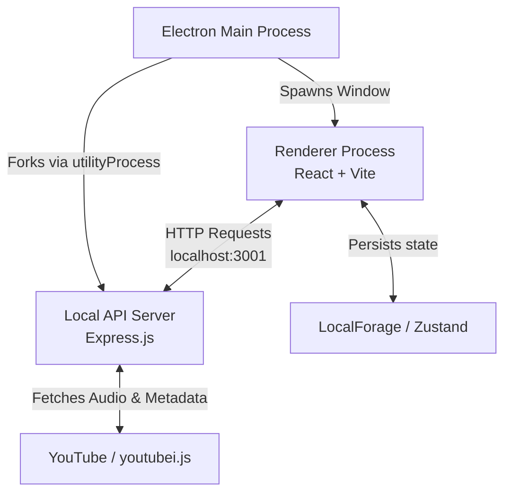

# Velune Desktop 🎵

Velune is a modern, cross-platform desktop music player built with Electron, React, TypeScript, and Vite. It offers a seamless listening experience with advanced library management, high-performance streaming, and robust offline capabilities.

## ✨ Features

- **Rich Music Library**: Manage your liked songs, saved playlists, and local playlists all in one place.
- **High-Performance Streaming**: Powered by `youtubei.js` to provide fast, reliable audio streaming directly from YouTube sources.
- **Advanced Offline Playback**: Download individual songs, full albums, or playlists for offline listening. The Downloads tab automatically groups your saved tracks by their original album or playlist.
- **Smart Listening History**: View your history as a chronological timeline or grouped by listening context (with smart badges showing exactly which playlist a song was played from).
- **Debounced Search**: Lightning-fast, optimized search experience that fetches results without overloading the API.
- **Discord Rich Presence**: Automatically show off what you're listening to on Discord (via `discord-rpc`).
- **Modern UI/UX**: Fluid animations (Framer Motion), clean icons (Lucide React), and a highly responsive design tailored for the desktop experience.

## 🛠️ Tech Stack

### Frontend (Renderer)
- **Framework**: React 18 & Vite
- **Language**: TypeScript
- **State Management**: Zustand (modular stores for Player and Library state)
- **Routing**: React Router DOM
- **Animations & Styling**: Framer Motion + Vanilla CSS Modules

### Backend & Desktop Layer (Main Process)
- **Framework**: Electron
- **Local API**: Express.js server (runs seamlessly within the Electron utility process to handle API requests and stream proxying)
- **Data & APIs**: `youtubei.js` for metadata and streaming
- **Packaging**: Electron Builder (NSIS, DMG, AppImage)

## 🏗️ Architecture

The application is structured into three main components that work together securely and efficiently:

1. **Renderer Process (Frontend)**: The React/Vite frontend where all UI rendering happens. It runs with Context Isolation enabled for security and communicates with the backend via standard HTTP requests.
2. **Utility Process (Backend)**: An Express.js server spawned by the Main Process using Electron's `utilityProcess`. This runs an independent Node environment to handle audio streams, YouTube metadata fetching, and file downloads without blocking the UI.
3. **Main Process**: The core Electron application that manages window creation, lifecycle events, and intercepts web requests to bypass CORS/Referer issues for streaming.



## 🚀 Getting Started

### Prerequisites
- **Node.js**: v20 or higher is strictly recommended.
- **Package Manager**: npm or yarn.
- **Git**: To clone the repository.
- **OS**: Windows, macOS, or Linux (Electron supports all three natively).

### Installation

1. Clone the repository and navigate into the project directory.
2. Install the dependencies:
   ```bash
   npm install
   ```

### Development

To start the application in development mode (which spins up both the Vite renderer server and the Express API server):

```bash
# Run web version in browser (Vite server + API server)
npm run dev

# OR run inside the Electron wrapper (Vite + API + Electron main)
npm run electron:dev
```

### Production Build & Packaging

To compile the application and package it for your operating system:

```bash
# Build the Vite renderer, Express server, and Electron main process
npm run build

# Package into an executable installer (.exe, .dmg, .AppImage)
npm run package
```
*Note: The built executable will be located in the `release-build` directory.*

## 📁 Project Structure

```
velune-desktop/
├── assets/           # Application icons and static assets
├── electron/         # Electron main process entry points (main.ts, preload.js)
├── src/
│   ├── api/          # Frontend API clients linking to the local Express server
│   ├── components/   # Reusable React components (TrackItem, Queue, Player, etc.)
│   ├── hooks/        # Custom React hooks (e.g., useAudio for playback logic)
│   ├── screens/      # Main application views (Library, Playlist, Album, Search, History)
│   ├── server/       # Express.js backend (handles downloads, yt streaming, etc.)
│   └── store/        # Zustand state stores (playerStore, libraryStore, settingsStore)
└── package.json
```

## 🤝 Contributing

Contributions, issues, and feature requests are welcome! Feel free to check the issues page if you want to contribute.

## 📝 License

This project is privately developed by the Velune Team.
